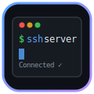

<p align="center">
  
</p>

<h1 align="center">WebTerm</h1>

<p align="center">
  <strong>Web-based SSH & Telnet client with a modern terminal UI — XShell in your browser</strong>
</p>

<p align="center">
  <a href="https://pypi.org/project/webterm"></a>
  <a href="https://github.com/mimonimo/webterm/blob/main/LICENSE"></a>
  
  <a href="https://github.com/mimonimo/webterm/stargazers"></a>
</p>

<p align="center">
  
</p>

---

**WebTerm** is a web-based SSH and Telnet client that runs in your browser. Think **XShell** or **MobaXterm**, but as a lightweight web app you can host anywhere. Connect to your servers with a beautiful dark terminal UI, manage multiple sessions with tabs, browse files via SFTP — all without installing any desktop software.

## Features

<table>
<tr>
<td width="50%">

### Terminal
- **Full SSH terminal** via xterm.js with 256 colors
- **Telnet support** with auto-negotiation
- **Multi-tab interface** — work on multiple servers simultaneously
- **Keyboard shortcuts** — Ctrl+Shift+N, Ctrl+W, Ctrl+Tab
- **Auto-resize** — terminal adapts to window size
- **Scrollback buffer** — 10,000 lines of history
- **Clickable links** — URLs are automatically linked
- **Custom fonts** — JetBrains Mono, Fira Code, etc.

</td>
<td width="50%">

### Management
- **Session manager** — save, organize, and group connections
- **Quick connect** — connect without saving
- **SFTP file browser** — browse, download files from sidebar
- **Password & key auth** — supports both authentication methods
- **Session groups** — organize servers by project, environment
- **Persistent sessions** — saved connections persist across restarts
- **Connection status** — real-time status in tabs and status bar

</td>
</tr>
</table>

## Quick Start

### Install & Run

```bash
pip install webterm
webterm
```

Then open **http://localhost:8765** in your browser.

### From Source

```bash
git clone https://github.com/mimonimo/webterm.git
cd webterm
pip install -e .
webterm
```

### Options

```bash
# Custom port
webterm --port 9090

# Bind to specific address
webterm --host 127.0.0.1

# Auto-reload for development
webterm --reload

# Show version
webterm --version
```

### Docker

```bash
docker run -d -p 8765:8765 mimonimo/webterm
```

## Screenshots

### Multi-Tab Terminal
<p align="center">
  
</p>

Multiple server connections in tabs with color-coded status indicators. Switch between servers instantly with Ctrl+Tab.

### Session Manager
<p align="center">
  
</p>

Save connections with groups. Double-click to connect. Supports SSH (password or key) and Telnet.

### SFTP File Browser
<p align="center">
  
</p>

Browse remote files directly in the sidebar. Click to navigate, download files with a single click.

### Connection Dialog
<p align="center">
  
</p>

Clean connection dialog with protocol selection, authentication options, and session saving.

## Architecture

```
Browser                          Server
┌──────────────────┐            ┌──────────────────────┐
│                  │            │    FastAPI + Uvicorn  │
│  xterm.js ◄──────┼── WSS ───►┤                      │
│  (Terminal UI)   │            │  ┌─────────────────┐ │        ┌──────────────┐
│                  │            │  │  SSH Handler     │─┼──SSH──►│ Remote Server│
│  Session Manager │◄── REST ──►│  │  (paramiko)      │ │        └──────────────┘
│                  │            │  ├─────────────────┤ │
│  SFTP Browser   │◄── REST ──►│  │  Telnet Handler  │─┼─Telnet─► Remote Server
│                  │            │  ├─────────────────┤ │
│                  │            │  │  SFTP Handler    │─┼─SFTP──► Remote Server
│                  │            │  ├─────────────────┤ │
│                  │            │  │  Session Store   │ │
│                  │            │  │  (JSON file)     │ │
│                  │            │  └─────────────────┘ │
└──────────────────┘            └──────────────────────┘
```

### How It Works

1. **Frontend** renders a terminal using [xterm.js](https://xtermjs.org/) with fit and web-links addons
2. **WebSocket** bridge connects the browser terminal to the Python backend
3. **SSH Handler** (paramiko) establishes a PTY session to the remote server
4. **Telnet Handler** manages raw TCP connections with telnet negotiation
5. **Data flows** bidirectionally: keystrokes → WebSocket → SSH/Telnet → server → response → WebSocket → xterm.js
6. **SFTP** operations go through the same SSH connection via paramiko's SFTP subsystem

### Tech Stack

| Component | Technology |
|-----------|-----------|
| Frontend Terminal | [xterm.js](https://xtermjs.org/) v5.5 |
| Backend | [FastAPI](https://fastapi.tiangolo.com/) + [Uvicorn](https://www.uvicorn.org/) |
| SSH | [Paramiko](https://www.paramiko.org/) |
| WebSocket | Native FastAPI WebSocket |
| UI Framework | Vanilla CSS (dark theme, no framework dependency) |
| Session Storage | JSON file (no database required) |

## Keyboard Shortcuts

| Shortcut | Action |
|----------|--------|
| `Ctrl+Shift+N` | New connection |
| `Ctrl+W` | Close current tab |
| `Ctrl+Tab` | Switch to next tab |
| `Ctrl+B` | Toggle sidebar |
| `Esc` | Close modal |

## Configuration

### Session Storage

Sessions are saved to `sessions.json` in the working directory. Passwords are **never** saved — you'll be prompted each time you connect from a saved session.

### Customization

The terminal supports these xterm.js features:
- **256 colors** — full color support
- **Unicode** — emoji, CJK characters, box drawing
- **Font** — JetBrains Mono (falls back to Fira Code, SF Mono, Consolas)
- **Theme** — GitHub Dark inspired color scheme

## Comparison

| Feature | WebTerm | XShell | MobaXterm | PuTTY | Wetty |
|---------|---------|--------|-----------|-------|-------|
| Web-based | :white_check_mark: | :x: | :x: | :x: | :white_check_mark: |
| Multi-tab | :white_check_mark: | :white_check_mark: | :white_check_mark: | :x: | :x: |
| Session manager | :white_check_mark: | :white_check_mark: | :white_check_mark: | :white_check_mark: | :x: |
| SFTP browser | :white_check_mark: | :white_check_mark: | :white_check_mark: | :x: | :x: |
| Telnet support | :white_check_mark: | :white_check_mark: | :white_check_mark: | :white_check_mark: | :x: |
| Free & open source | :white_check_mark: | :x: | Partial | :white_check_mark: | :white_check_mark: |
| No install needed | :white_check_mark: | :x: | :x: | :x: | :white_check_mark: |
| Self-hosted | :white_check_mark: | N/A | N/A | N/A | :white_check_mark: |
| Cross-platform | :white_check_mark: | Windows only | Windows only | Windows only | :white_check_mark: |
| Key auth | :white_check_mark: | :white_check_mark: | :white_check_mark: | :white_check_mark: | :x: |

## Use Cases

- **DevOps & SysAdmins** — manage servers from any device with a browser
- **Cloud Infrastructure** — access jump hosts and bastion servers
- **Lab Environments** — connect to network devices via Telnet
- **Education** — teach SSH/Linux without installing software on student machines
- **Shared Access** — host WebTerm on an internal server for team use
- **Chromebook / iPad** — full SSH access from devices that don't support native clients
- **Emergency Access** — when you don't have your usual SSH client available

## Security Notes

- WebTerm is designed for **internal/private network use**
- Passwords are transmitted over WebSocket — use HTTPS in production
- Sessions are stored in a local JSON file without passwords
- Always run behind a reverse proxy (nginx/caddy) with TLS in production
- Consider adding authentication middleware for multi-user deployments

### Production Setup (nginx + TLS)

```nginx
server {
    listen 443 ssl;
    server_name webterm.example.com;

    ssl_certificate /etc/letsencrypt/live/webterm.example.com/fullchain.pem;
    ssl_certificate_key /etc/letsencrypt/live/webterm.example.com/privkey.pem;

    location / {
        proxy_pass http://127.0.0.1:8765;
        proxy_http_version 1.1;
        proxy_set_header Upgrade $http_upgrade;
        proxy_set_header Connection "upgrade";
        proxy_set_header Host $host;
        proxy_set_header X-Real-IP $remote_addr;
    }
}
```

## Contributing

Contributions welcome! Planned features:

- [ ] Split-pane terminals (horizontal/vertical)
- [ ] Terminal recording & playback
- [ ] SSH tunneling / port forwarding
- [ ] File upload via SFTP
- [ ] Search in terminal output
- [ ] Custom color themes
- [ ] LDAP/OAuth authentication
- [ ] Docker Compose setup
- [ ] Serial port (COM) support

## License

MIT License — see [LICENSE](LICENSE) for details.

---

<p align="center">
  Made with care by <a href="https://github.com/mimonimo">@mimonimo</a>
</p>
